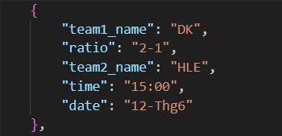

# Báo cáo về Data Crawling

## 1. Giới thiệu

Bài này sử dụng kỹ thuật Data Crawling để thu thập dữ liệu từ trang web về lịch thi đấu LCK mùa hè 2024. Data Crawling là quá trình tự động thu thập thông tin từ các trang web, giúp dễ dàng trích xuất thông tin mà không cần thực hiện thủ công.

## 2. Các thư viện và công cụ sử dụng

Trong bài thực hành này, em sử dụng các công cụ sau để thực hiện quá trình crawling:
- **Requests**: Dùng để gửi yêu cầu HTTP tới URL và nhận về nội dung HTML.
- **BeautifulSoup**: Được sử dụng để phân tích cú pháp HTML và tìm các phần tử cần thiết trong trang web.
- **JSON**: Dùng để lưu trữ dữ liệu có cấu trúc và phân tích dễ dàng.

Ví dụ code để import các thư viện:

\`\`\`python
import requests
from bs4 import BeautifulSoup
import json
\`\`\`

## 3. Quy trình thu thập dữ liệu

#### 1.Cài đặt virtual environment
1. **Tạo thư mục môi trường**: tạo thư mục **venv** với lệnh `python3 -m venv venv`
2. **Kích hoạt thư mục**: sử dụng lệnh `venv\Scripts\activate.bat`
3. **Cài đặt thư viện Requests và BeautifulSoup**: `pip install -r requirements.txt`

#### 2.Các bước thực hiện lấy dữ liệu
Dưới đây là các bước chính trong quá trình thu thập dữ liệu từ trang web mục tiêu:

1. **Gửi yêu cầu HTTP**: sử dụng `requests.get()` để gửi yêu cầu HTTP đến trang web và lấy nội dung HTML.
2. **Phân tích HTML**: sử dụng BeautifulSoup để phân tích và trích xuất dữ liệu từ HTML nhận được.
3. **Trích xuất dữ liệu**: Các phần tử HTML chứa thông tin về lịch thi đấu được trích xuất và lưu vào một định dạng dễ sử dụng.

## 4. Kết quả

Sau khi phân tích HTML, em đã trích xuất thành công dữ liệu lịch thi đấu LCK mùa hè năm 2024 bao gồm: Tên của 2 đội tuyển thi đấu với nhau, tỉ số trận đấu, thời gian diễn ra trận đấu theo định dạng file **JSON**

**Minh họa output**

## 5. Kết luận

Data Crawling là một phương pháp hiệu quả để tự động thu thập thông tin từ các trang web. Với việc sử dụng `requests` và `BeautifulSoup`, em có thể trích xuất thông tin cần thiết từ HTML của trang web và lưu trữ dưới dạng có cấu trúc.